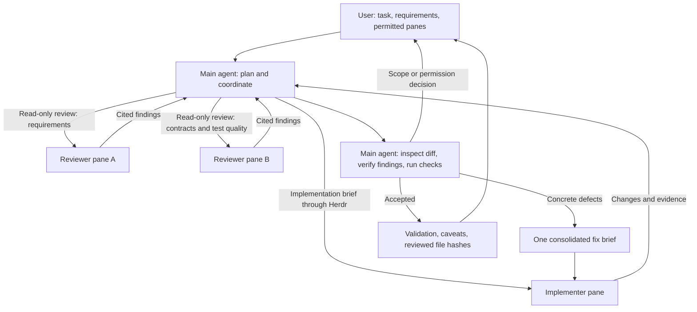
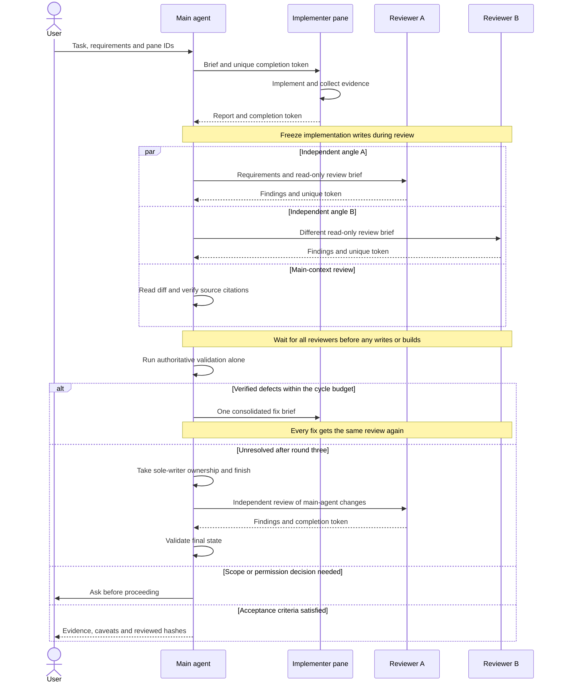

# Panel

**One agent implements. Other agents review. Your main agent verifies the evidence. You decide the scope.**

Panel is a [Claude Code](https://claude.com/claude-code) skill for coordinating coding agents in [Herdr](https://herdr.dev/docs/integrations/)-managed terminal panes. Give your main agent a task and the panes it may use; it delegates implementation, reads the actual changes, gathers independent reviews, and sends back one consolidated set of fixes.

This repository contains the workflow instructions, not a new agent runtime or hosted service. The delegated agents are **real, already-running CLI sessions in sibling panes**, not Claude Code's built-in subagents. They can use different tools or models: Codex, ZCode, Antigravity (`agy`), OpenCode, Pi, OMP, or another agent that can receive terminal prompts.

## How it works



The diagram shows a main agent plus three sibling panes. One sibling implements; the other two review different aspects of the same frozen change. With two sibling panes, there is one independent reviewer. With only one, the main agent reviews the implementer's work itself and reports the missing cross-agent coverage.

### A round, step by step

1. **Validate the participants.** Check each pane's identity, working directory and readiness. Read the repository's own agent instructions before preparing the task.
2. **Choose one implementer.** Route by the task's likely failure mode, not its size. An explicit `pane=` overrides routing. Agent-specific preferences are starting heuristics, not model guarantees.
3. **Delegate a concrete brief.** Include scope, acceptance criteria, source documents, constraints and required evidence. Long briefs go in a permitted scratch file, not a multiline terminal paste.
4. **Wait for real completion.** Use Herdr's state tracking plus a unique completion token for that dispatch. An idle pane alone can mean a question or permission prompt, not finished work.
5. **Review independently.** The main agent reads the actual diff in its original context. Other named panes review concurrently with distinct questions: specification omissions and wrong values, correctness and boundaries, or interface claims and test quality.
6. **Verify, then decide.** Check source citations, reproduce relevant behavior and run the repository's full validation gate alone. Send one merged fix brief to the same implementer, or accept the result with evidence and caveats.



### Why the extra review?

A successful build does not prove that the requirements were implemented. Several agents can also agree on a wrong interpretation. Panel asks for checkable evidence rather than a vote:

- Open the cited source before turning a review finding into a fix instruction.
- Check both missing requirements and implemented values that disagree with the specification.
- Verify that tests cover the changed code, fail for the intended reason when behavior breaks, and have not been weakened.
- Review fakes and mocks against the real provider contract; test allowed outcomes as well as denied ones.
- After a fix, inspect callers, changed expected values and regressions—not just the named symptom.
- Record reviewed file hashes so the eventual commit can be compared with the working tree that was actually reviewed.

## Install

### Prerequisites

- Claude Code as the main agent, with shell, file-reading and user-question tools available.
- Herdr running the participating terminal panes, with its CLI available to the main agent.
- At least one sibling coding-agent session, already started in the intended repository/worktree.
- Active Herdr state tracking for semantic waits. A completion-token fallback is documented for agents without a hook.
- Git and the target project's normal validation tools. Node.js is additionally required only for the optional ZCode hook below.

Panel does not start or authenticate the sibling agents for you. Their ordinary permissions, provider access and usage charges still apply.

From the root of this checkout, copy the skill into your user-level Claude Code skills directory:

```sh
mkdir -p ~/.claude/skills/panel
cp panel/SKILL.md ~/.claude/skills/panel/SKILL.md
```

This replaces an existing installed copy; preserve any local customizations first. Alternatively, symlink the file so future repository updates are picked up automatically. The skill is self-contained: no separate delegation skill is required.

## Quick start

1. Open the target project in a Herdr workspace.
2. Start Claude Code in the main pane. Start one or more coding agents in sibling panes pointing at the same checkout. Keep them idle until assigned work.
3. Inspect available agents and integrations:

   ```sh
   herdr agent list
   herdr integration status
   ```

4. In the main agent, invoke `/panel` with the actual pane IDs and a concrete task.

**Single implementer, main-agent review:**

```text
/panel pane=p4 Fix the flaky sorting test in tests/sort.test.ts
```

**Route implementation and use the remaining panes as reviewers:**

```text
/panel codex-pane=p5 zcoder-pane=p4 agy-pane=p3 Implement the serializer per docs/spec.md
```

**Fully qualified pane ID:**

```text
/panel pane=w3:p4 Add regression coverage for empty input
```

These IDs and paths are illustrative; replace them with your own. Bare `pN` IDs resolve using the main session's `HERDR_WORKSPACE_ID`, never the currently focused workspace. Without that environment value, supply a full `wX:pN` ID. The skill rejects targeting its own pane.

Named pane arguments may appear in any order. `zcode-pane=` aliases `zcoder-pane=`; `gemini-pane=` and `antigravity-pane=` alias `agy-pane=`. Other leading `<name>-pane=<id>` arguments identify additional candidate agents; the actual running agent is checked rather than inferred from the label.

If you omit pane arguments, Panel asks you to choose—it does not silently recruit sessions. Fix rounds stay with the original implementer so its context is retained.

## Coordination and safety rules

- **One implementation writer per checkout.** Separate concurrent implementation tasks need separate worktrees. Reviewers do not edit, create files, stage or commit.
- **Review a frozen version.** Wait for every reviewer's dispatch-specific completion token before changing files. Reviewers must not build or run commands that modify shared output or caches.
- **Serialize validation.** No overlapping builds, cleanups, fix rounds or second gate jobs. Preserve complete logs and the real exit status; do not hide failures behind output-filtering pipelines.
- **Keep humans in control.** Ask about ambiguity, broader scope, busy/wrong-directory panes and unapproved permissions. No blind approval of terminal dialogs, and no staging, committing or pushing without an explicit request.
- **Bound the fix loop.** A cycle has at most three implementation/review rounds, including the initial implementation. After round three, the main agent finishes remaining in-scope fixes and obtains independent review. Genuinely new defects can start a new cycle; repeated serious findings require an explicit discussion rather than an endless loop.
- **Review the main agent too.** Manual finishes and later feedback fixes are not exempt from non-author review and final validation.
- **Keep private material out of handoffs.** Do not send secrets or credentials in prompts, briefs or reports. Review logs and scratch files before sharing; do not commit coordination artifacts accidentally.

These are instructions followed by the agents, **not an enforced sandbox**. Review coverage, tool access and runtime checks can be unavailable; the final report must say so rather than imply a pass. Multi-agent review adds latency and usage cost, so reserve the full panel for work that benefits from independent scrutiny.

## Optional: ZCode state reporting

The bundled [`panel/herdr-zcode`](panel/herdr-zcode) plugin translates ZCode lifecycle hooks into Herdr state reports. It lets the main agent use semantic state tracking instead of repeatedly reading the terminal screen when ZCode is not natively detected.

| ZCode event | Herdr state |
| --- | --- |
| `SessionStart` | `idle` |
| `UserPromptSubmit`, `PreToolUse` | `working` |
| `PermissionRequest` | `blocked` |
| `PostToolUse`, `PostToolUseFailure` | `working` |
| `Stop` | `idle` |

### Enable the plugin

1. Make the plugin directory available to ZCode. For example, from this repository root, create a local symlink if the destination does not already exist:

   ```sh
   mkdir -p ~/.zcode/plugins
   ln -s "$(pwd)/panel/herdr-zcode" ~/.zcode/plugins/herdr-zcode
   ```

2. In ZCode, open **Settings → Plugins**, add the local plugin source if needed, and enable `herdr-zcode`.
3. Confirm hooks are enabled in the user-level configuration (`~/.zcode/cli/config.json`). The plugin supplies `hooks/hooks.json`; do not register that file a second time in the plugin manifest or retain a duplicate manual registration of the same hook.
4. Start a **new ZCode session inside Herdr**. Hook configuration is captured at session startup; an existing session may not load a newly enabled plugin.

The hook is a no-op outside Herdr. Inside a managed pane, it uses `HERDR_ENV`, `HERDR_PANE_ID` and `HERDR_BIN_PATH` (falling back to `herdr` on `PATH`). No machine-specific binary path or workspace ID is bundled.

Verify with your actual ZCode pane ID:

```sh
herdr agent list
herdr agent get w3:p4
herdr agent wait w3:p4 --until idle
```

### Troubleshooting and limits

- **Missing from `herdr integration status`:** custom ZCode reporting may still be working. Inspect `herdr agent get` instead of assuming the hook needs installation.
- **Reported as `unknown`:** confirm Node.js is available, hooks are enabled, and the session was newly started inside Herdr. Inspect `herdr pane read w3:p4 --source detection` using your actual pane ID.
- **`agent_not_ready` during dispatch:** registration may have disappeared while the process remains alive. Inspect the pane and confirm whether the prompt landed before retrying. The skill includes a direct-pane fallback with an anchored, unique completion token.
- **Idle without a token:** do not assume completion. Inspect for a question, permission request or exited agent.
- **Herdr server restart:** re-check the pane. The custom integration does not restore sessions or guarantee release when the agent process exits, and does not supply model, quota or task metadata.

See Herdr's [integration guide](https://herdr.dev/docs/integrations/) and ZCode's [hooks guide](https://zcode.z.ai/en/docs/hooks) for the underlying integration mechanisms.

## Repository contents

| Path | Purpose |
| --- | --- |
| [`panel/SKILL.md`](panel/SKILL.md) | Full delegation, routing, review, verification and handoff instructions |
| [`panel/herdr-zcode/.zcode-plugin/plugin.json`](panel/herdr-zcode/.zcode-plugin/plugin.json) | Optional ZCode plugin manifest |
| [`panel/herdr-zcode/hooks/hooks.json`](panel/herdr-zcode/hooks/hooks.json) | Lifecycle event registrations |
| [`panel/herdr-zcode/hooks/report-herdr.mjs`](panel/herdr-zcode/hooks/report-herdr.mjs) | Node.js hook that reports state to Herdr |
| [`LICENSE`](LICENSE) | License terms |

The published workflow uses generic examples, not private project transcripts or personal configuration. When updating it from a local copy, preserve the operational lessons without importing names, private paths, ticket IDs, credentials or identifiable project details.
